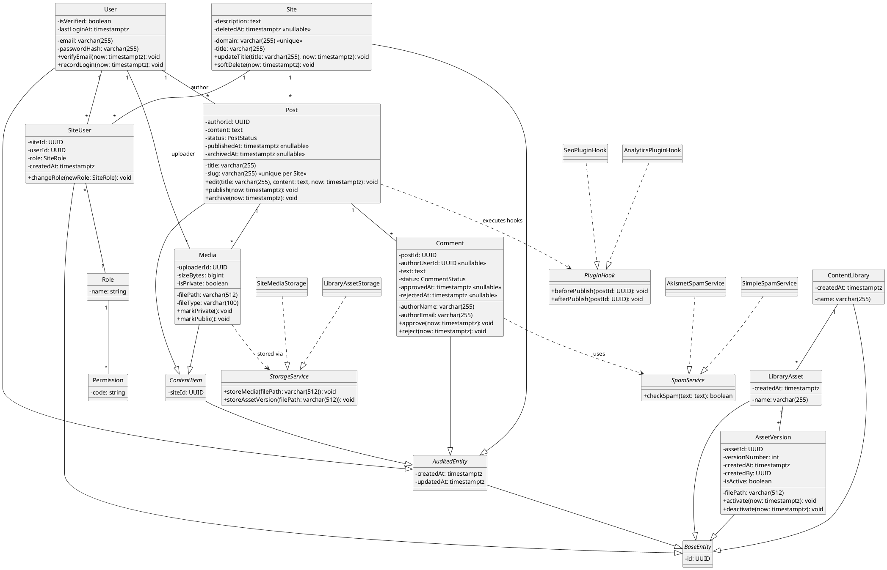
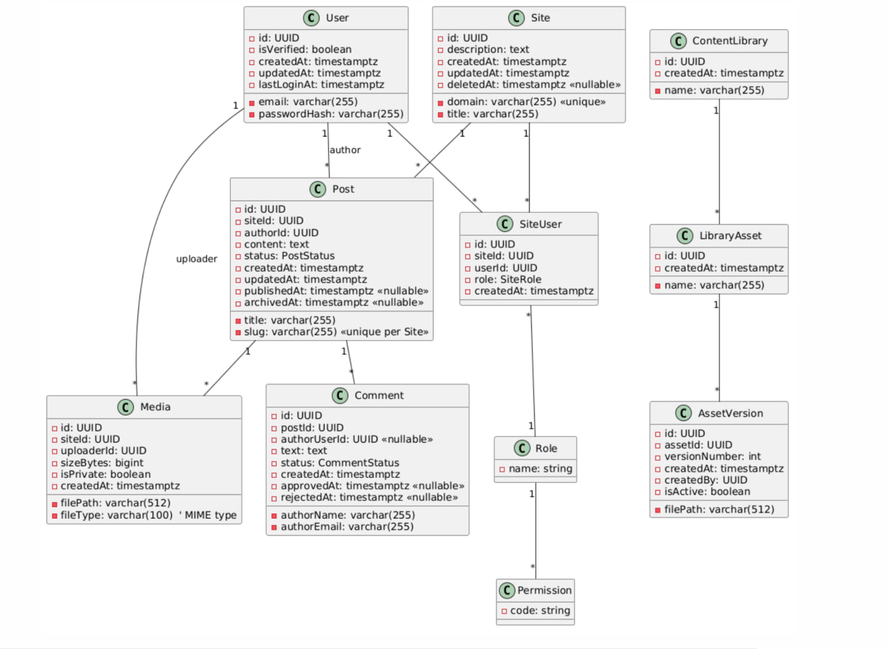
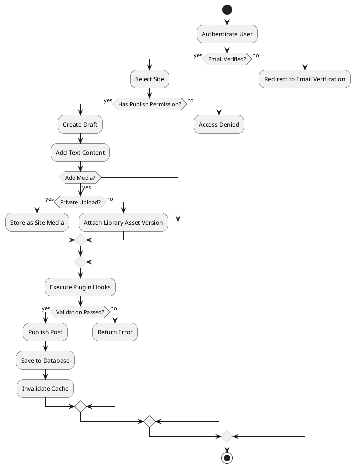
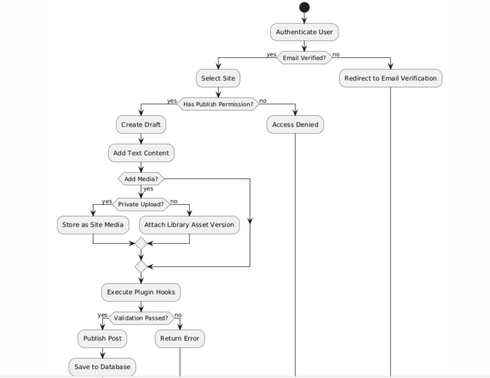
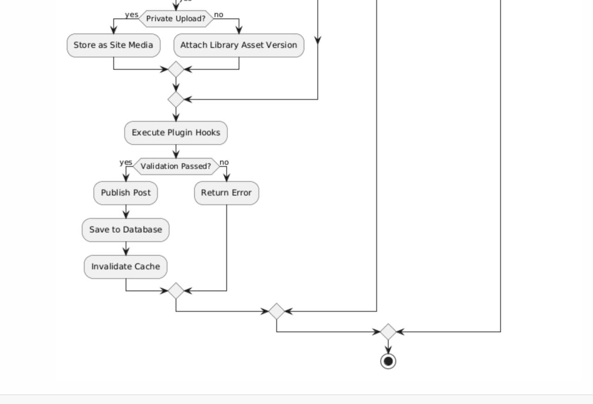
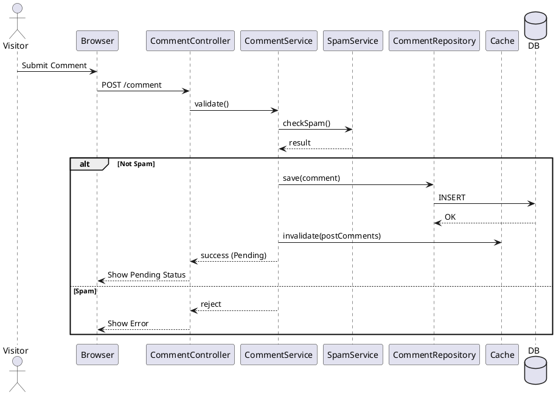
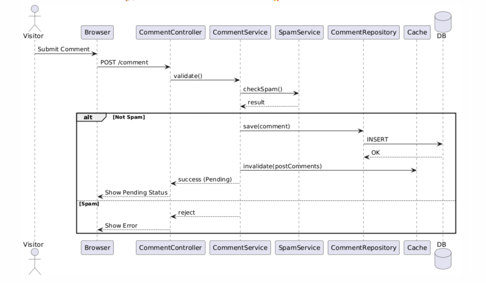
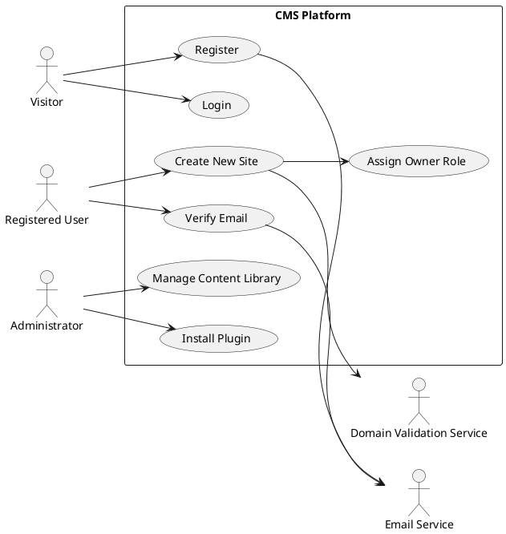
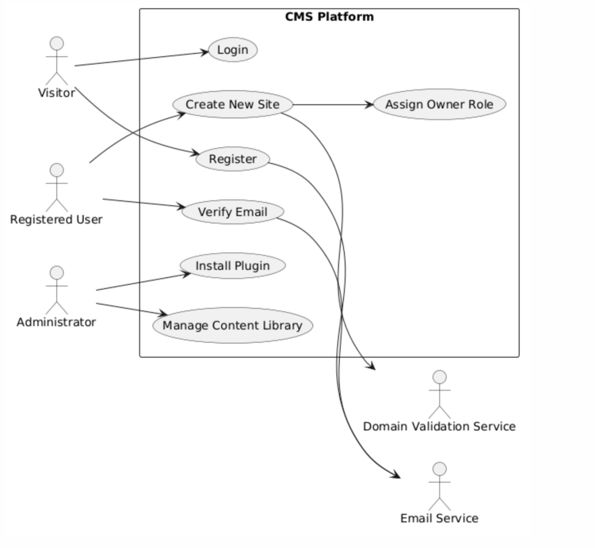

# CMS UML Diagrams

This document collects all UML diagrams for the CMS architecture used in the laboratory work.

---

# Class Diagram

---

# Activity Diagram

---

# Sequence Diagram

---

# Use Case Diagram

